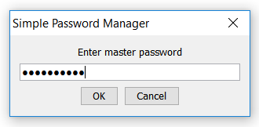
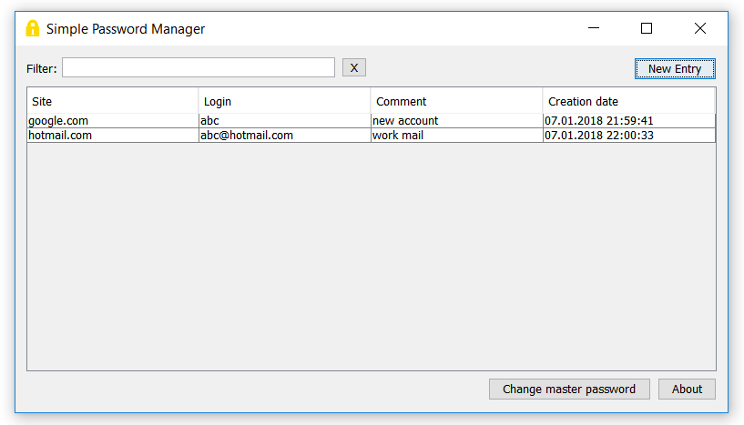

# Simple Password Manager


A simple program that locally stores your passwords in an encrypted form.

## Features
- Sufficient encryption (AES 128bit)
- Lightweight
- Multi-platform
- Uses UTF-8
- Open-source
- Extremely permissive license

## Usage
- Windows users<br/>
Just download SPM.exe from [Releases](https://github.com/AlexIII/spm/releases), put it somewhere, create a shortcut and run.
- Other platforms<br/>
Download SPM.jar from [Releases](https://github.com/AlexIII/spm/releases) and run it with your JVM (`java -jar SPM.jar`). You can also find a program icon in `src/resources/`
- Paranoid<br/>
Review the source code thoroughly and built it yourself

On the first run the program creates database file `spmdb.xml` in the current directory.

## Hints
- Double click puts the password into the clipboard
- The clipboard is automatically cleared in 30 seconds after coping the password or when the program is being closed
- Filter acts on "Site", "Login" and "Comment" fields
- "Site", "Login" and "Comment" fields are being encrypted too

## Requirements
- [JRE 1.8](http://www.oracle.com/technetwork/java/javase/downloads/jre8-downloads-2133155.html)

## Build

```sh
javac -source 1.8 -target 1.8 -d out src/spm/*.java
jar cfe dist/SPM.jar spm.SPMgui -C out .
```

## Screencaps



## Software
GUI was created with [NetBeans IDE](https://netbeans.org/)<br/>
Executable for Windows was created with [Launch4j](http://launch4j.sourceforge.net/)

## License
[WTFPL v2](http://www.wtfpl.net)

## Changelog

- v1.4
  - Add password generator
  - Fix xml extra new-lines problem
